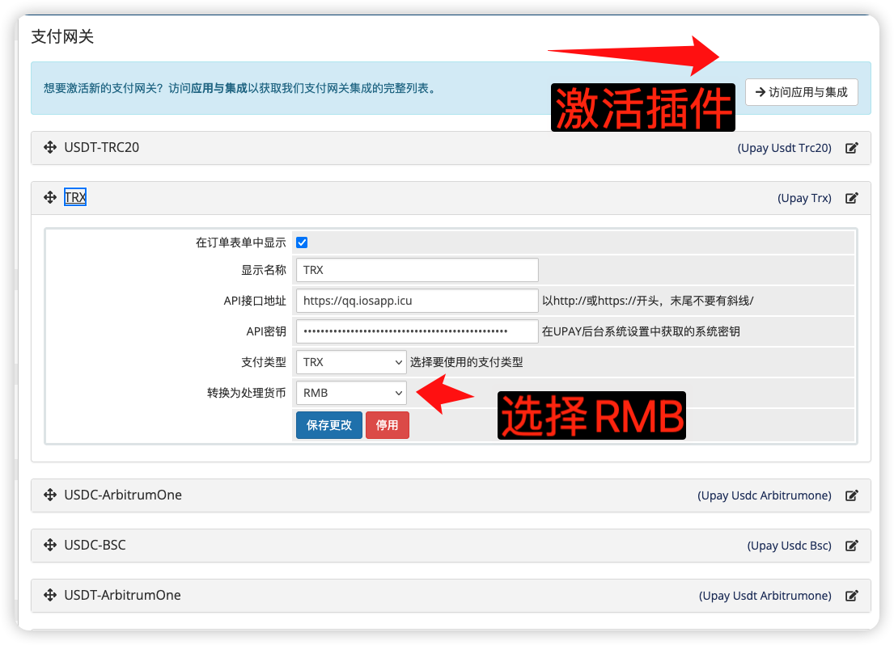
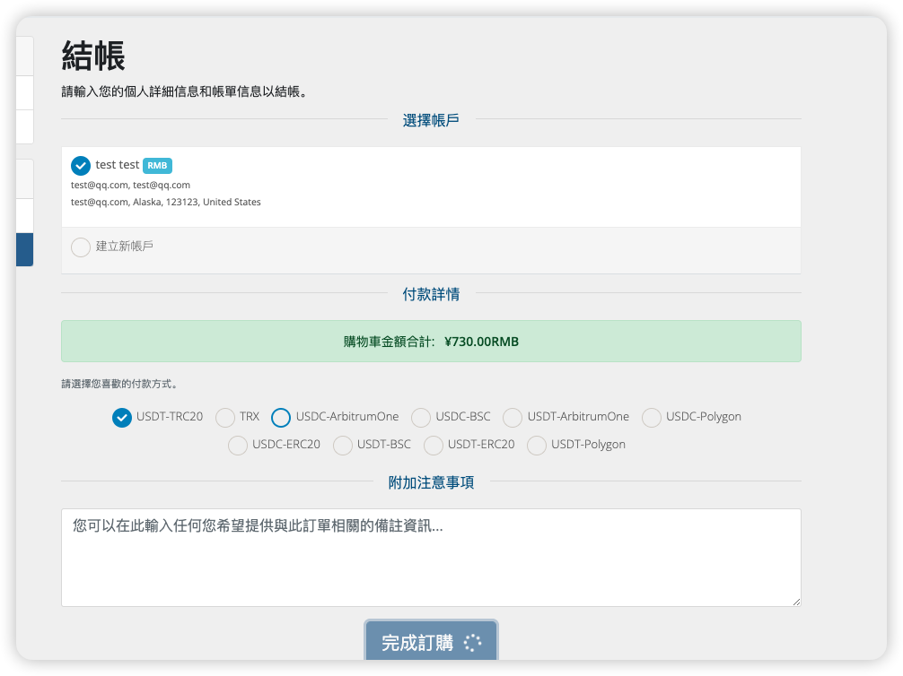
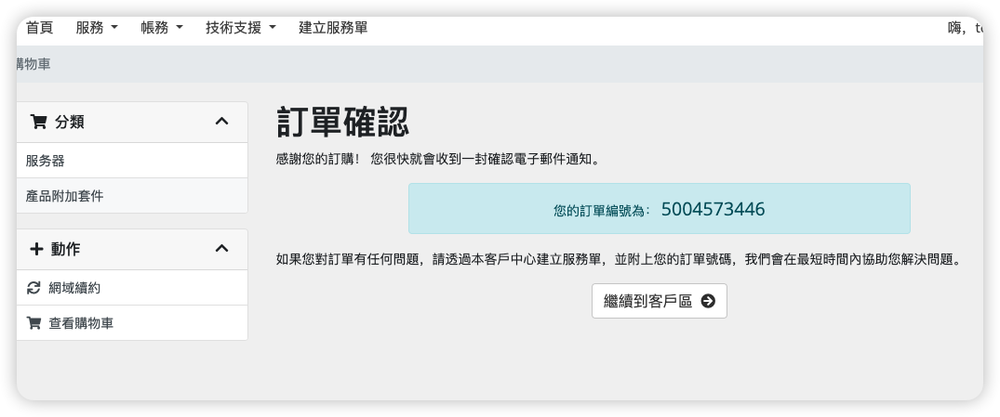

# WHMCS UPAY 数字货币支付插件

## 插件文件上传位置

### 方式一：单一插件（支持所有支付类型）【前台只显示一个支付方式，不推荐，】

```
/modules/gateways/upay.php
/modules/gateways/callback/upay.php
```

### 方式二：10 个专用货币插件（每种货币一个独立插件）【推荐】

```
/modules/gateways/upay_usdt_trc20.php
/modules/gateways/callback/upay_usdt_trc20.php

/modules/gateways/upay_trx.php
/modules/gateways/callback/upay_trx.php

/modules/gateways/upay_usdt_polygon.php
/modules/gateways/callback/upay_usdt_polygon.php

/modules/gateways/upay_usdt_bsc.php
/modules/gateways/callback/upay_usdt_bsc.php

/modules/gateways/upay_usdt_erc20.php
/modules/gateways/callback/upay_usdt_erc20.php

/modules/gateways/upay_usdt_arbitrumone.php
/modules/gateways/callback/upay_usdt_arbitrumone.php

/modules/gateways/upay_usdc_erc20.php
/modules/gateways/callback/upay_usdc_erc20.php

/modules/gateways/upay_usdc_polygon.php
/modules/gateways/callback/upay_usdc_polygon.php

/modules/gateways/upay_usdc_bsc.php
/modules/gateways/callback/upay_usdc_bsc.php

/modules/gateways/upay_usdc_arbitrumone.php
/modules/gateways/callback/upay_usdc_arbitrumone.php
```

## 插件激活

1. 登录 WHMCS 管理后台
2. 进入 Setup > Payments > Payment Gateways
3. 在"All Payment Gateways"标签页中找到插件
4. 点击"Activate"激活插件

## 配置参数

激活后需要配置：

1. API 接口地址 - UPAY 系统访问地址
2. API 密钥 - 在 UPAY 后台获取

## 界面预览

### 插件列表



### 支付界面



### 支付成功界面



## 注意事项

- 如使用专用货币插件，每种货币有独立配置界面
- 确保 WHMCS 服务器可访问 UPAY 系统
- 确保 UPAY 系统可访问 WHMCS 的回调地址
