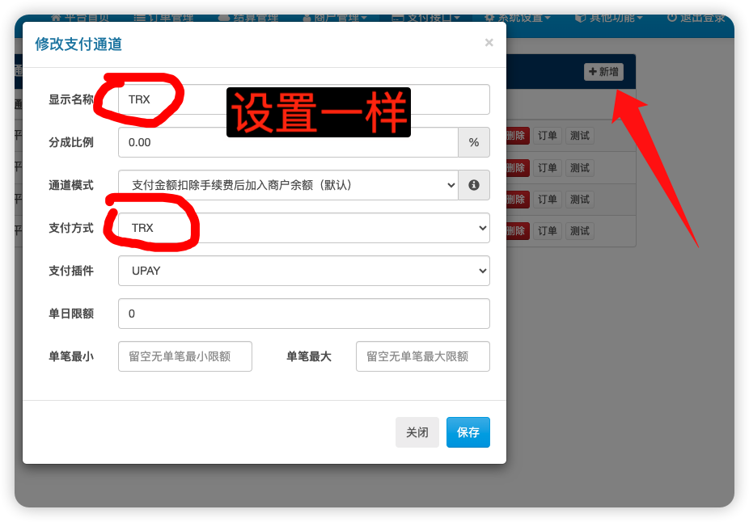
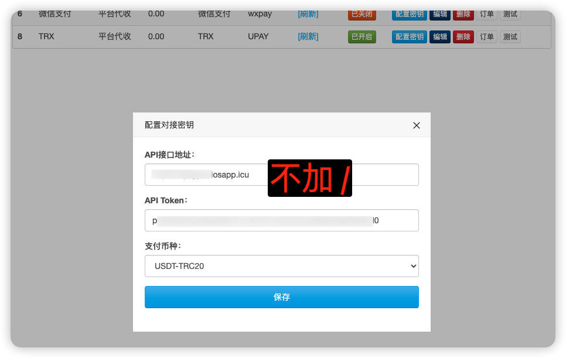

# 对接易支付的 UPAY 支付插件

## 1、插件上传

### 注意：目录命名为 UPAY

## 2、易支付后台刷新插件列表

支付标识和支付名称任选下面其一即可

## 3、新增支付方式

这 3 个都可以新增一下

|   支付标识   |   支付名称   |
| :----------: | :----------: |
|  USDT-TRC20  |  USDT-TRC20  |
|     TRX      |     TRX      |
| USDT-Polygon | USDT-Polygon |

## 4、新增支付通道

## 5、配置密钥

#### 这里的支付币种要和你第 4 步的支付方式一样

