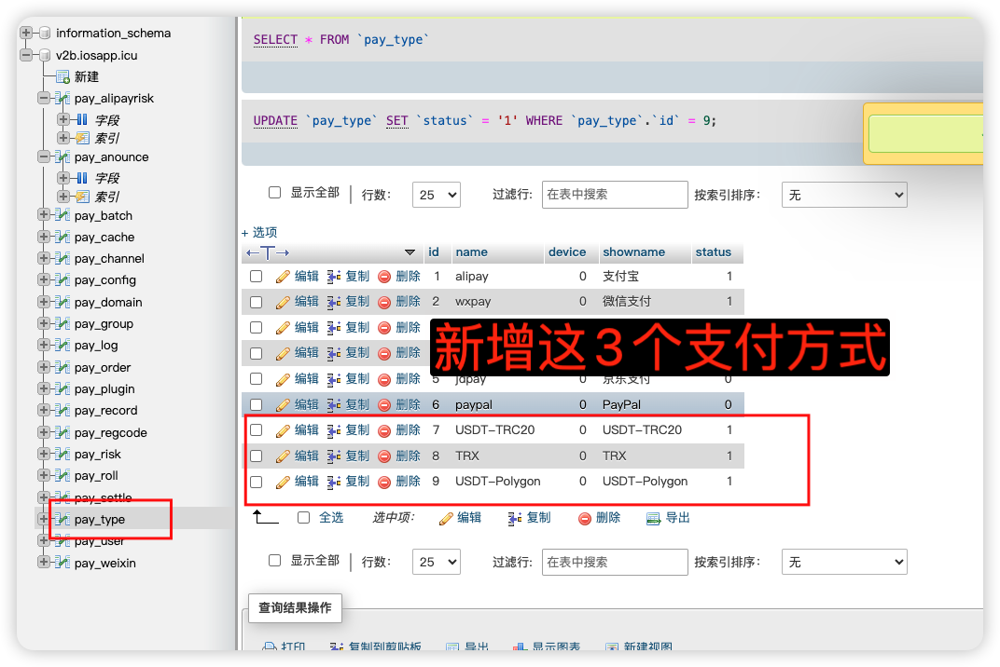

# 对接易支付的 UPAY 支付插件

检查你的易支付设置了伪静态没,如果没有设置,请设置伪静态

```
location / {
 if (!-e $request_filename) {
   rewrite ^/(.[a-zA-Z0-9\-\_]+).html$ /index.php?mod=$1 last;
 }
 rewrite ^/pay/(.*)$ /pay.php?s=$1 last;
}
location ^~ /plugins {
  deny all;
}
location ^~ /includes {
  deny all;
}

```

## 1、插件上传

### 注意：目录命名为 UPAY


## 2、易支付后台刷新插件列表


支付标识和支付名称任选下面其一即可

## 3、新增支付方式

在数据库表 pay_type 中新增这个 3 个支付方式



这 3 个都可以新增一下

|   支付标识   |   支付名称   |
| :----------: | :----------: |
|  USDT-TRC20  |  USDT-TRC20  |
|     TRX      |     TRX      |
| USDT-Polygon | USDT-Polygon |

## 4、新增支付通道


## 5、配置密钥

#### 这里的支付币种要和你第 4 步的支付方式一样


## 6、商店侧新增支付通道

支付标识必须是你易支付中的支付标识的其一


