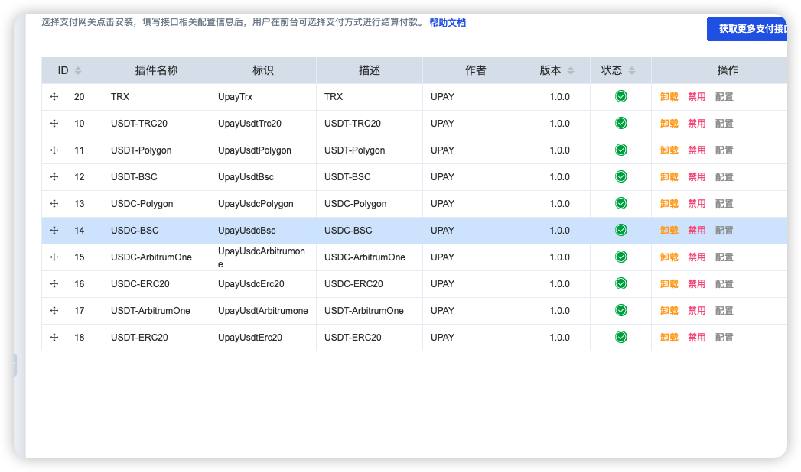

# UPAY + 智简魔方 支付插件

## 插件介绍

本插件集成了 UPAY 数字货币支付系统，支持多种主流数字货币的支付功能，包括：

- USDT-TRC20
- USDT-ERC20
- USDT-Polygon
- USDT-ArbitrumOne
- USDT-BSC
- TRX
- USDC-ERC20
- USDC-Polygon
- USDC-ArbitrumOne
- USDC-BSC

## 安装说明

### 1. 插件上传位置

```
/www/wwwroot/zjmf.shunge.cc/public/plugins/gateways
```

### 2. PHP 7.4 配置

在 php.ini 文件中增加以下配置：

```
extension=idcsmart.so
idcsmart.app=Upay_Usdt_Trc20,Upay_Usdt_Erc20,Upay_Trx,Upay_Usdt_Polygon,Upay_Usdt_Arbitrumone,Upay_Usdc_Erc20,Upay_Usdc_Bsc,Upay_Usdc_Polygon,Upay_Usdc_Arbitrumone
```

## 使用说明

1. 将插件文件夹上传到指定目录
2. 在智简魔方后台激活相应插件
3. 配置各插件的 API 密钥和接口地址
4. 测试支付功能确保正常运行

## 插件开发参考文档

[智简魔方插件开发文档](https://www.idcsmart.com/wiki_list/555.html)

## 魔方开心版

[魔方开心版 GitHub 地址](https://github.com/aazooo/zjmf)

## 版权信息

- 插件作者：@hellokvm
- 协助者：@Jason_0o


