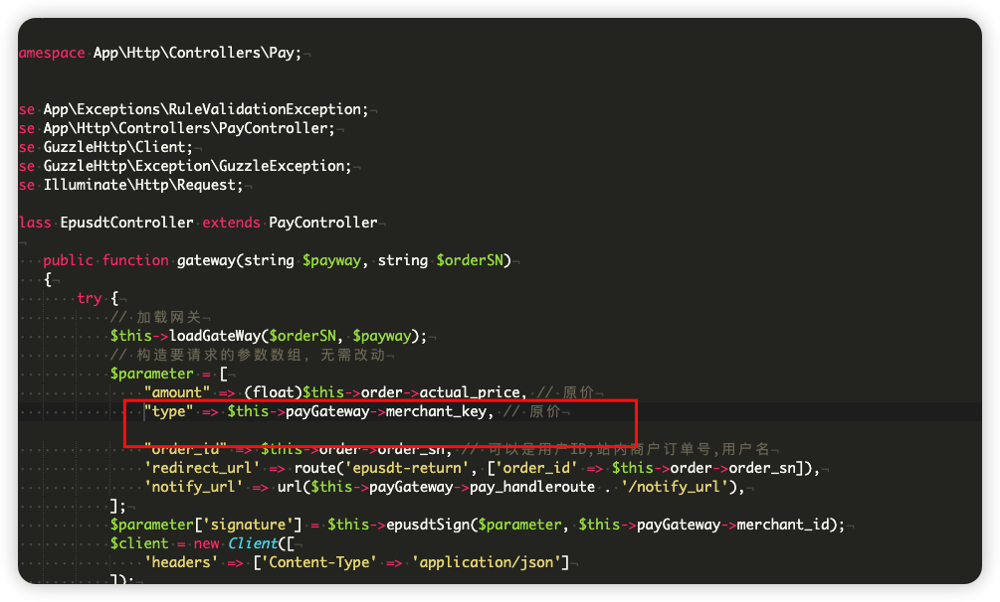
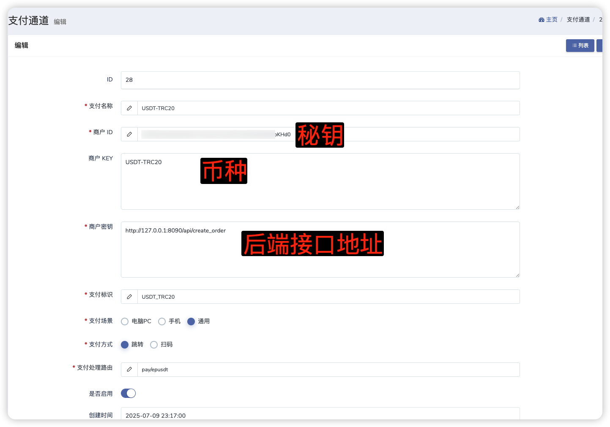

# 独角数卡对接教程

## 📋 概述

本文档详细介绍如何将 UPay Pro 支付系统与独角数卡商城系统进行对接，实现自动化的数字货币支付功能。

## 🔧 对接步骤

### 1. 修改独角数卡插件文件

文件路径：app/Http/Controllers/Pay/EpusdtController.php

在独角数卡的 **epusdt 插件文件第 29 行** 增加以下代码：

```php
"type" => $this->payGateway->merchant_key,
```

**说明**: 此修改用于传递支付类型参数，确保 UPay Pro 能够正确识别支付币种。

### 2. 配置支付网关

#### 2.1 UPay Pro 系统配置

1. **访问管理后台**: `http://your-domain`
2. **配置钱包地址**: 在钱包管理中添加对应币种的收款地址
3. **设置汇率**: 配置各币种的实时汇率
4. **获取密钥**: 记录系统生成的 API 密钥

#### 2.2 独角数卡系统配置

**方式一：新增支付方式**

- 在独角商城后台新增 UPay Pro 支付方式
- 配置支付接口参数

**方式二：修改现有 epusdt 支付**

- 直接修改现有的 epusdt 支付配置
- 将接口地址指向 UPay Pro 系统

### 3. 接口参数配置

#### 3.1 基础配置

| 参数名   | 说明              | 示例值                                     |
| -------- | ----------------- | ------------------------------------------ |
| 接口地址 | UPay Pro API 地址 | `http://your-domain:8090/api/create_order` |
| 商户密钥 | 系统生成的密钥    | `your_secret_key`                          |
| 支付类型 | 币种标识          | `USDT-TRC20`、`TRX`、`USDT-Polygon`        |

#### 3.2 支持的币种类型

- **USDT-TRC20**: 基于 TRON 网络的 USDT
- **TRX**: TRON 原生代币
- **USDT-Polygon**: 基于 Polygon 网络的 USDT
- **USDT-BSC**: 基于 BSC 网络的 USDT
- **USDT-ERC20**: 基于 ERC20 网络的 USDT
- **USDT-ArbitrumOne**: 基于 ArbitrumOne 网络的 USDT
- **USDC-ERC20**: 基于 ERC20 网络的 USDC
- **USDC-Polygon**: 基于 Polygon 网络的 USDC
- **USDC-BSC**: 基于 BSC 网络的 USDC
- **USDC-ArbitrumOne**: 基于 ArbitrumOne 网络的 USDC

## 🖼️ 配置截图

### epusdt 插件配置



### 独角商城支付配置



## 📞 技术支持

如遇到技术问题，请：

1. 查看 UPay Pro 系统日志：`logs/upay.log`
2. 检查独角数卡系统日志
3. 参考 [UPay Pro API 文档](../../支付接口API文档.md)
4. 联系技术支持团队

---

**更新时间**: 2025 年 7 月
**文档版本**: v1.0
